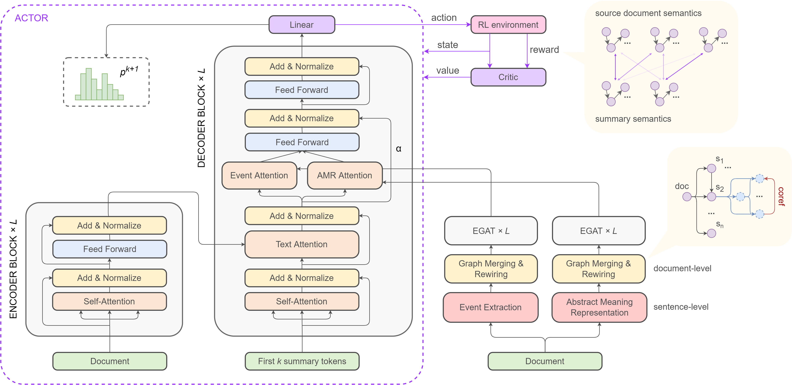
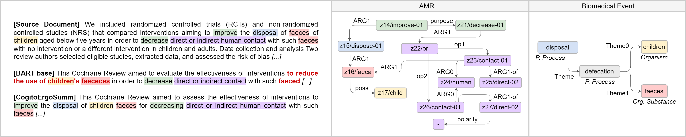
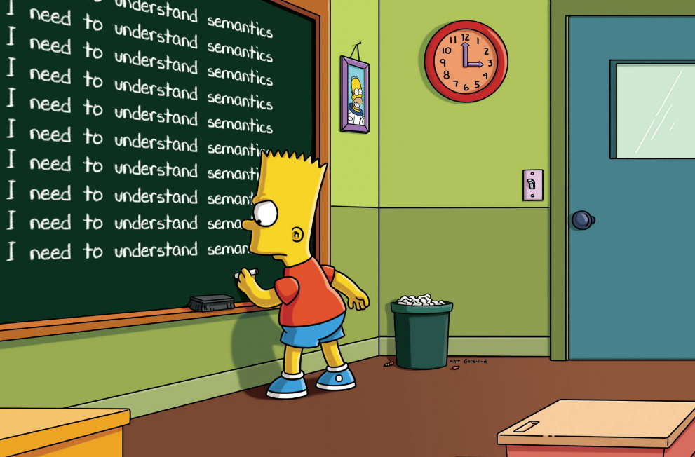

# 🧠 Cogito Ergo _Summ_

> "I think, therefore I summarize"

<!-------------------------------------------------------------------------------->

## Overview

Code and data accompanying the AAAI23 paper ["Cogito Ergo Summ: Abstractive Summarization of Biomedical Papers via Semantic Parsing Graphs and Consistency Rewards"](frisoni_italiani_salvatori_moro_AAAI2023.pdf).

CogitoErgoSumm is the first framework for single-document biomedical abstractive summarization equipping large pre-trained language models with rich domain-specific and domain-general semantic parsing graphs: events and AMRs. Event and AMR graph embeddings are learned by edge-aware graph attention networks. We propose new decoder cross-attention modules, and design a reinforcement learning (RL) reward signal to preserve source-summary semantics consistency.

  

Experiments and ablation studies on CDSR demonstrate that our framework sets new marks in informativeness, factuality, and readability, better selecting and preserving summary-worth content.

  

<!-------------------------------------------------------------------------------->

## 🔎 Paper

Read our [paper](frisoni_italiani_salvatori_moro_AAAI2023.pdf)

## 🔎 Poster

Read our [poster](AAAI23_poster.pdf)

## 🔎 Supplementary Material

Read our [supplementary material](AAAI23_supplementary_material.pdf)

<!-------------------------------------------------------------------------------->

## ✉ Contacts

* Giacomo Frisoni, [giacomo.frisoni[at]unibo.it](mailto:giacomo.frisoni@unibo.it)
* Paolo Italiani, [paolo.italiani[at]studio.unibo.it](mailto:paolo.italiani2@unibo.it)
* Stefano Salvatori, [s.salvatori[at]unibo.it](mailto:s.salvatori@unibo.it)
* Gianluca Moro, [gianluca.moro[at]unibo.it](mailto:gianluca.moro@unibo.it)

If you have troubles, suggestions, or ideas, the [Discussion](https://github.com/disi-unibo-nlp/cogito-ergo-summ/discussions) board might have some relevant information. If not, you can post your questions there 💬🗨.

<!-------------------------------------------------------------------------------->

## License

This project is released under the CC-BY-NC-SA 4.0 license (see `LICENSE`).

<!-------------------------------------------------------------------------------->

## Cite

If you use CogitoErgoSumm in your research, please cite:

    @article{frisoni-etal-2023-cogitoergosumm,
      title     = {Cogito Ergo Summ: Abstractive Summarization of Biomedical Papers via Semantic Parsing Graphs and Consistency Rewards},
      author    = {Giacomo, Frisoni and Paolo, Italiani and Gianluca, Moro and Stefano, Salvatori},
      booktitle = {Thirty-Seventh {AAAI} Conference on Artificial Intelligence, {AAAI} 2023},
      pages     = {1--10},
      publisher = {{AAAI} Press},
      year      = {2023}
    }

